# Testing

> [!NOTE]  
> Return back to the [README.md](README.md) file.


## Code Validation


### HTML


I have used the recommended [HTML W3C Validator](https://validator.w3.org) to validate all of my HTML files.

| Directory | File  | Screenshot | 
| --- | --- | --- | 
| connections | [discover.html](https://github.com/Scaphix/match_up/blob/main/connections/templates/connections/discover.html) | 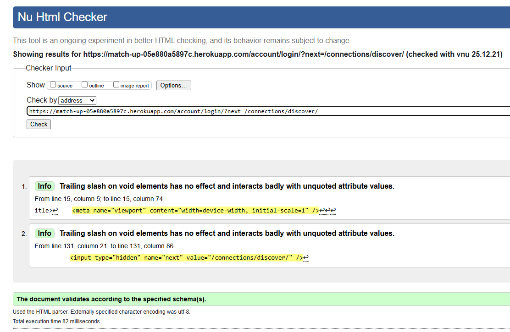 | 
| connections | [liked_profiles.html](https://github.com/Scaphix/match_up/blob/main/connections/templates/connections/liked_profiles.html) |   | 
| connections | [matches.html](https://github.com/Scaphix/match_up/blob/main/connections/templates/connections/ matches.html) |  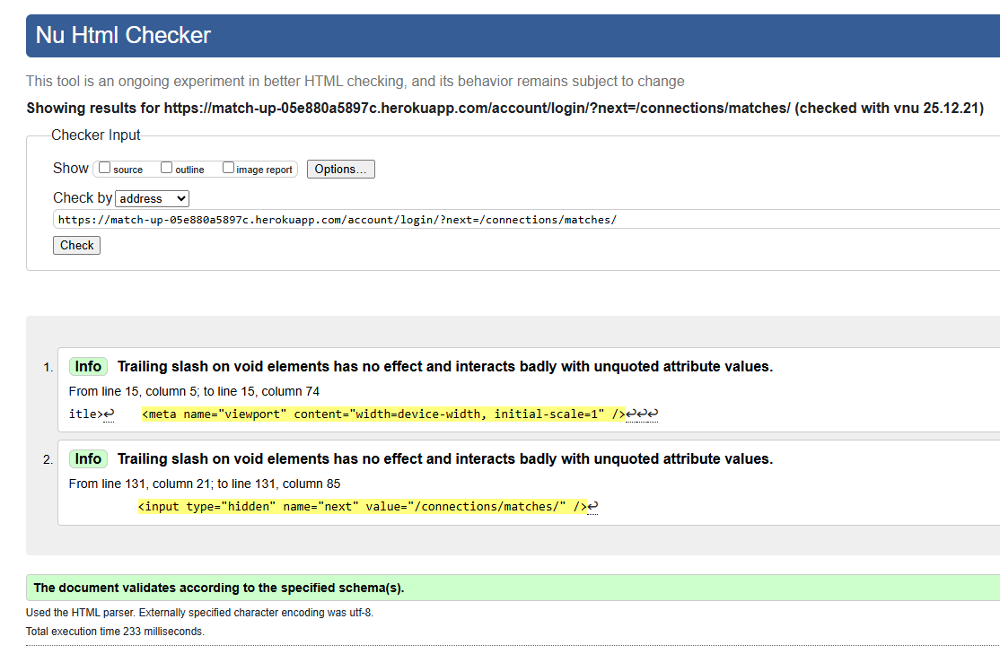 | 
| dating | [about.html](https://github.com/Scaphix/match_up/blob/main/dating/templates/dating/about.html) |   | 
| dating | [contact.html](https://github.com/Scaphix/match_up/blob/main/dating/templates/dating/contact.html) |   | 
| dating | [index.html](https://github.com/Scaphix/match_up/blob/main/dating/templates/dating/index.html) |  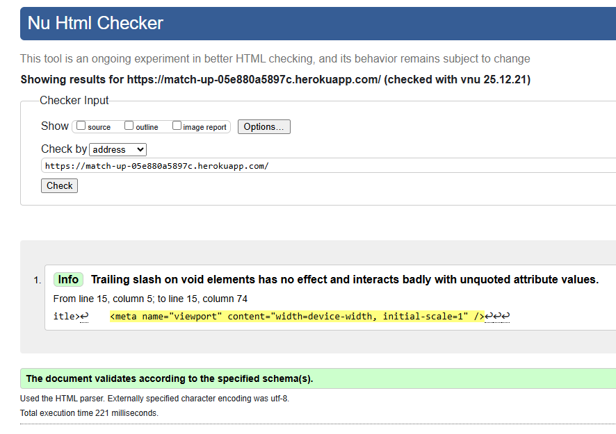 | 
| dating | [profile_delete.html](https://github.com/Scaphix/match_up/blob/main/dating/templates/dating/profile_delete.html)  | 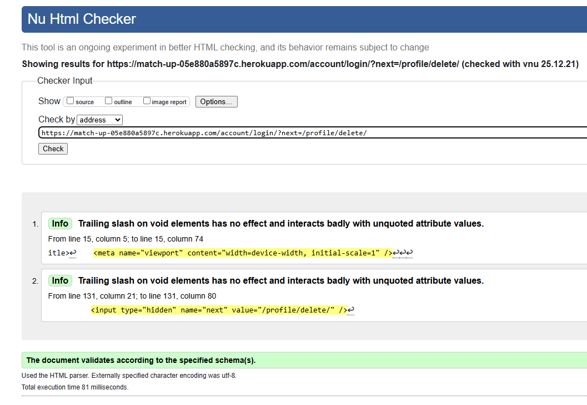 | 
| dating | [profile_detail.html](https://github.com/Scaphix/match_up/blob/main/dating/templates/dating/profile_detail.html)  | 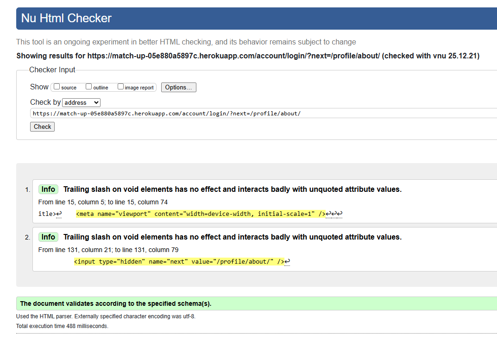 | 
| dating | [profile_form.html](https://github.com/Scaphix/match_up/blob/main/dating/templates/dating/profile_form.html) |  | 
| dating | [profile_list.html](https://github.com/Scaphix/match_up/blob/main/dating/templates/dating/profile_list.html)  |  | 
| templates | [404.html](https://github.com/Scaphix/match_up/blob/main/templates/404.html) |  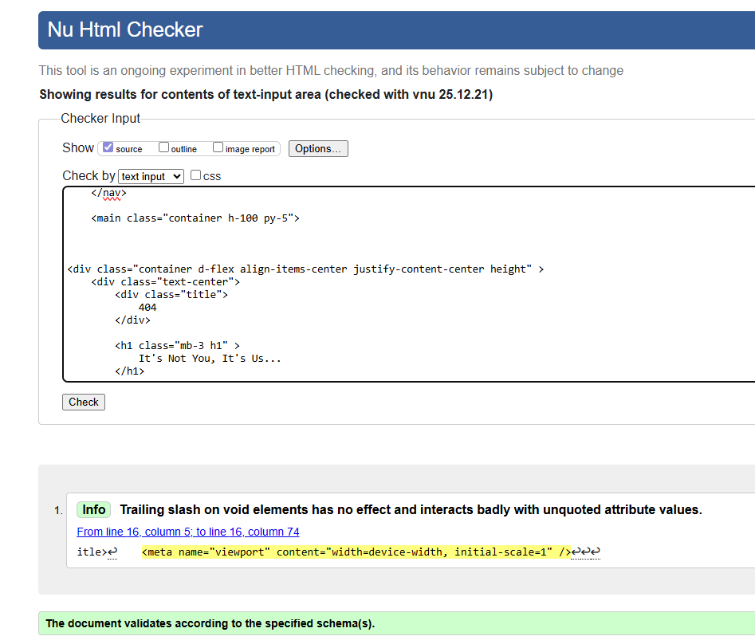 | 
| templates | [login.html](https://github.com/Scaphix/match_up/blob/main/templates/account/login.html) |  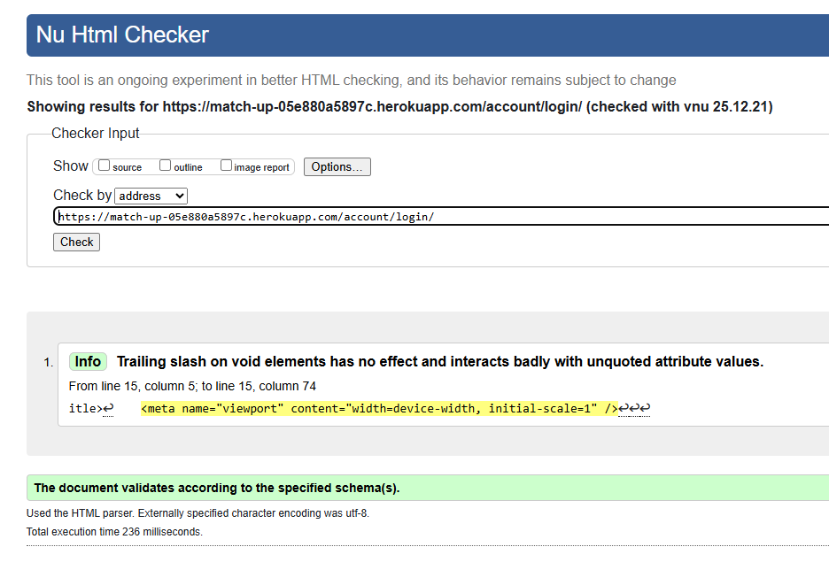 | 
| templates | [logout.html](https://github.com/Scaphix/match_up/blob/main/templates/account/logout.html) |  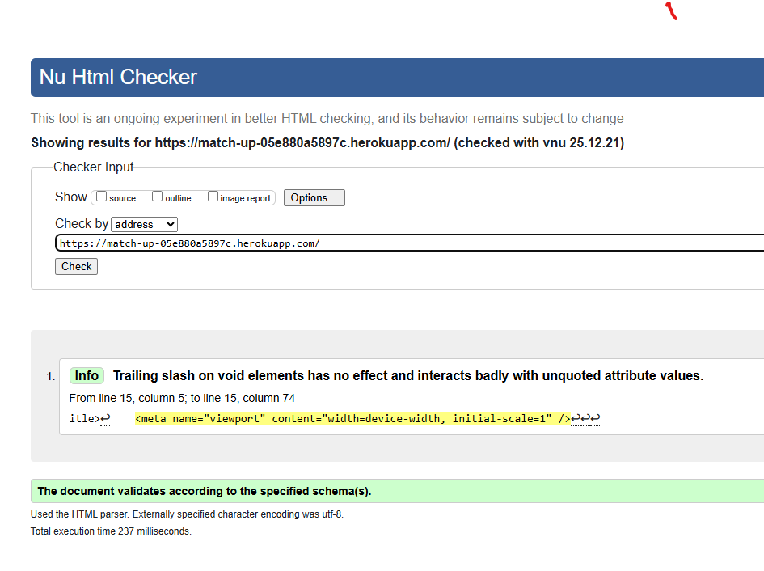 | 
| templates | [signup.html](https://github.com/Scaphix/match_up/blob/main/templates/account/signup.html) |  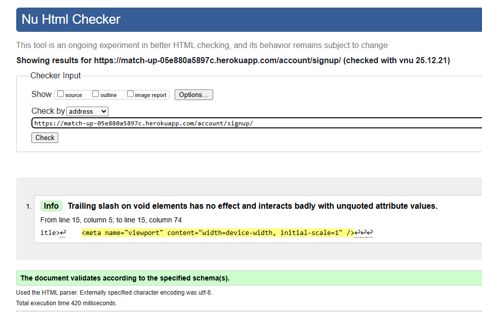 | 

### CSS


I have used the recommended [CSS Jigsaw Validator](https://jigsaw.w3.org/css-validator) to validate all of my CSS files.

| Directory | File | URL | Screenshot | Notes |
| --- | --- | --- | --- | --- |
| static | [style.css](https://github.com/Scaphix/match_up/blob/main/static/css/style.css) | ⚠️ Link (if applicable) |  | ⚠️ Notes (if applicable) |


### JavaScript


I have used the recommended [JShint Validator](https://jshint.com) to validate all of my JS files.

| Directory | File | URL | Screenshot | Notes |
| --- | --- | --- | --- | --- |
| static | [script.js](https://github.com/Scaphix/match_up/blob/main/static/js/script.js) |  |  | ⚠️ Notes (if applicable) |


### Python


I have used the recommended [PEP8 CI Python Linter](https://pep8ci.herokuapp.com) to validate all of my Python files.

| Directory | File | URL | Screenshot | Notes |
| --- | --- | --- | --- | --- |
| connections | [admin.py](https://github.com/Scaphix/match_up/blob/main/connections/admin.py) | [PEP8 CI Link](https://pep8ci.herokuapp.com/https://raw.githubusercontent.com/Scaphix/match_up/main/connections/admin.py) |  | ⚠️ Notes (if applicable) |
| connections | [models.py](https://github.com/Scaphix/match_up/blob/main/connections/models.py) | [PEP8 CI Link](https://pep8ci.herokuapp.com/https://raw.githubusercontent.com/Scaphix/match_up/main/connections/models.py) |  | ⚠️ Notes (if applicable) |
| connections | [services.py](https://github.com/Scaphix/match_up/blob/main/connections/services.py) | [PEP8 CI Link](https://pep8ci.herokuapp.com/https://raw.githubusercontent.com/Scaphix/match_up/main/connections/services.py) |  | ⚠️ Notes (if applicable) |
| connections | [signals.py](https://github.com/Scaphix/match_up/blob/main/connections/signals.py) | [PEP8 CI Link](https://pep8ci.herokuapp.com/https://raw.githubusercontent.com/Scaphix/match_up/main/connections/signals.py) |  | ⚠️ Notes (if applicable) |
| connections | [tests.py](https://github.com/Scaphix/match_up/blob/main/connections/tests.py) | [PEP8 CI Link](https://pep8ci.herokuapp.com/https://raw.githubusercontent.com/Scaphix/match_up/main/connections/tests.py) |  | ⚠️ Notes (if applicable) |
| connections | [urls.py](https://github.com/Scaphix/match_up/blob/main/connections/urls.py) | [PEP8 CI Link](https://pep8ci.herokuapp.com/https://raw.githubusercontent.com/Scaphix/match_up/main/connections/urls.py) |  | ⚠️ Notes (if applicable) |
| connections | [views.py](https://github.com/Scaphix/match_up/blob/main/connections/views.py) | [PEP8 CI Link](https://pep8ci.herokuapp.com/https://raw.githubusercontent.com/Scaphix/match_up/main/connections/views.py) |  | ⚠️ Notes (if applicable) |
| dating | [admin.py](https://github.com/Scaphix/match_up/blob/main/dating/admin.py) | [PEP8 CI Link](https://pep8ci.herokuapp.com/https://raw.githubusercontent.com/Scaphix/match_up/main/dating/admin.py) |  | ⚠️ Notes (if applicable) |
| dating | [forms.py](https://github.com/Scaphix/match_up/blob/main/dating/forms.py) | [PEP8 CI Link](https://pep8ci.herokuapp.com/https://raw.githubusercontent.com/Scaphix/match_up/main/dating/forms.py) |  | ⚠️ Notes (if applicable) |
| dating | [models.py](https://github.com/Scaphix/match_up/blob/main/dating/models.py) | [PEP8 CI Link](https://pep8ci.herokuapp.com/https://raw.githubusercontent.com/Scaphix/match_up/main/dating/models.py) |  | ⚠️ Notes (if applicable) |
| dating | [tests.py](https://github.com/Scaphix/match_up/blob/main/dating/tests.py) | [PEP8 CI Link](https://pep8ci.herokuapp.com/https://raw.githubusercontent.com/Scaphix/match_up/main/dating/tests.py) |  | ⚠️ Notes (if applicable) |
| dating | [urls.py](https://github.com/Scaphix/match_up/blob/main/dating/urls.py) | [PEP8 CI Link](https://pep8ci.herokuapp.com/https://raw.githubusercontent.com/Scaphix/match_up/main/dating/urls.py) |  | ⚠️ Notes (if applicable) |
| dating | [views.py](https://github.com/Scaphix/match_up/blob/main/dating/views.py) | [PEP8 CI Link](https://pep8ci.herokuapp.com/https://raw.githubusercontent.com/Scaphix/match_up/main/dating/views.py) |  | ⚠️ Notes (if applicable) |
|  | [manage.py](https://github.com/Scaphix/match_up/blob/main/manage.py) | [PEP8 CI Link](https://pep8ci.herokuapp.com/https://raw.githubusercontent.com/Scaphix/match_up/main/manage.py) |  | ⚠️ Notes (if applicable) |
| match_up | [settings.py](https://github.com/Scaphix/match_up/blob/main/match_up/settings.py) | [PEP8 CI Link](https://pep8ci.herokuapp.com/https://raw.githubusercontent.com/Scaphix/match_up/main/match_up/settings.py) |  | ⚠️ Notes (if applicable) |
| match_up | [urls.py](https://github.com/Scaphix/match_up/blob/main/match_up/urls.py) | [PEP8 CI Link](https://pep8ci.herokuapp.com/https://raw.githubusercontent.com/Scaphix/match_up/main/match_up/urls.py) |  | ⚠️ Notes (if applicable) |


## Responsiveness


I've tested my deployed project to check for responsiveness issues.

| Page | Mobile | Tablet | Desktop | Notes |
| --- | --- | --- | --- | --- |
| Register |  |  |  | Works as expected |
| Login |  |  |  | Works as expected |
| Home |  |  |  | Works as expected |
| Add Blog |  |  |  | Works as expected |
| Edit Blog |  |  |  | Works as expected |
| Blog Post |  |  |  | Works as expected |
| 404 |  |  |  | Works as expected |

## Browser Compatibility


I've tested my deployed project on multiple browsers to check for compatibility issues.

| Page | Chrome | Firefox | Safari | Notes |
| --- | --- | --- | --- | --- |
| Register |  |  |  | Works as expected |
| Login |  |  |  | Works as expected |
| Home |  |  |  | Works as expected |
| Add Blog |  |  |  | Works as expected |
| Edit Blog |  |  |  | Works as expected |
| Blog Post |  |  |  | Works as expected |
| 404 |  |  |  | Works as expected |

## Lighthouse Audit


I've tested my deployed project using the Lighthouse Audit tool to check for any major issues. Some warnings are outside of my control, and mobile results tend to be lower than desktop.

| Page | Mobile | Desktop |
| --- | --- | --- |
| Register |  | 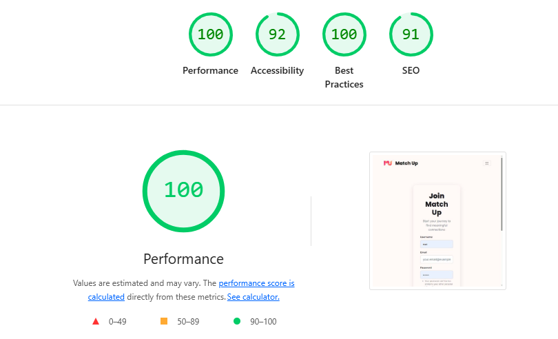 |
| Login | 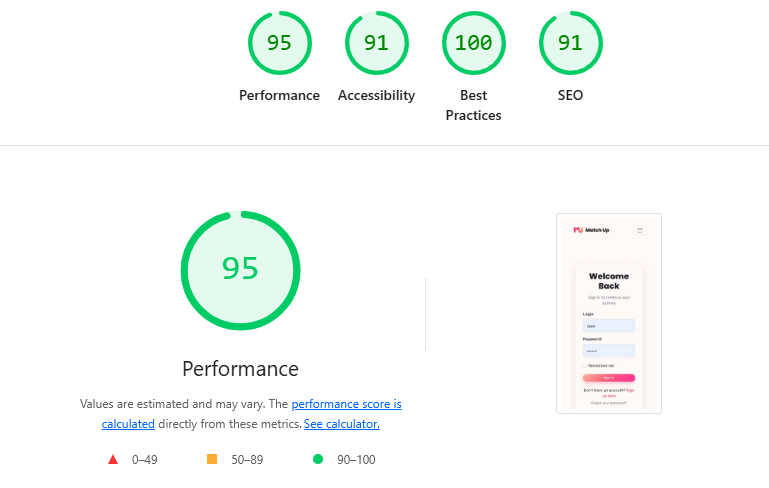 | 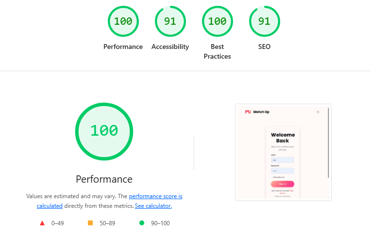 |
| Home |  |  |
| Add Blog |  |  |
| Edit Blog |  |  |
| Blog Post |  |  |
| 404 |  |  |

## Defensive Programming


Defensive programming was manually tested with the below user acceptance testing:

| Page | Expectation | Test | Result | Screenshot |
| --- | --- | --- | --- | --- |
| Blog Management | Feature is expected to allow the blog owner to create new posts with a title, featured image, and content. | Created a new post with valid title, image, and content data. | Post was created successfully and displayed correctly in the blog. |  |
| | Feature is expected to allow the blog owner to update existing posts. | Edited the content of an existing blog post. | Post was updated successfully with the new content. |  |
| | Feature is expected to allow the blog owner to delete blog posts. | Attempted to delete a blog post, confirming the action before proceeding. | Blog post was deleted successfully. |  |
| | Feature is expected to retrieve a list of all published posts. | Accessed the blog owner dashboard to view all published posts. | All published posts were displayed in a list view. |  |
| | Feature is expected to preview posts as drafts before publishing. | Created a draft post and previewed it. | Draft was displayed correctly in preview mode. |  |
| Comments Management | Feature is expected to allow the blog owner to approve or reject comments. | Approved and rejected comments from the dashboard. | Approved comments were published; rejected comments were removed. |  |
| | Feature is expected to allow the blog owner to edit or delete comments. | Edited and deleted existing comments. | Comments were updated or removed successfully. |  |
| User Authentication | Feature is expected to allow registered users to log in to the site. | Attempted to log in with valid and invalid credentials. | Login was successful with valid credentials; invalid credentials were rejected. |  |
| | Feature is expected to allow users to register for an account. | Registered a new user with unique credentials. | User account was created successfully. |  |
| | Feature is expected to allow users to log out securely. | Logged out and tried accessing a restricted page. | Access was denied after logout, as expected. |  |
| User Comments | Feature is expected to allow registered users to leave comments on blog posts. | Logged in and added comments to a blog post. | Comments were successfully added and marked as pending approval. |  |
| | Feature is expected to display a notification that comments are pending approval. | Added a comment and checked the notification message. | Notification was displayed as expected. |  |
| | Feature is expected to allow users to edit their own comments. | Edited personal comments. | Comments were updated as expected. |  |
| | Feature is expected to allow users to delete their own comments. | Deleted personal comments. | Comments were removed as expected. |  |
| Guest Features | Feature is expected to allow guest users to read blog posts without registering. | Opened blog posts as a guest user. | Blog posts were fully accessible without logging in. |  |
| | Feature is expected to display the names of other commenters on posts. | Checked the names of commenters on posts as a guest user. | Commenter names were displayed as expected. |  |
| | Feature is expected to block standard users from brute-forcing admin pages. | Attempted to navigate to admin-only pages by manipulating the URL (e.g., `/admin`). | Access was blocked, and a message was displayed showing denied access. |  |
| 404 Error Page | Feature is expected to display a 404 error page for non-existent pages. | Navigated to an invalid URL (e.g., `/test`). | A custom 404 error page was displayed as expected. |  |

## User Story Testing


| Target | Expectation | Outcome | Screenshot |
| --- | --- | --- | --- |
| As a blog owner | I would like to create new blog posts with a title, featured image, and content | so that I can share my experiences with my audience. |  |
| As a blog owner | I would like to update existing blog posts | so that I can correct or add new information to my previous stories. |  |
| As a blog owner | I would like to delete blog posts | so that I can remove outdated or irrelevant content from my blog. |  |
| As a blog owner | I would like to retrieve a list of all my published blog posts | so that I can manage them from a central dashboard. |  |
| As a blog owner | I would like to preview a post as draft before publishing it | so that I can ensure formatting and content appear correctly. |  |
| As a blog owner | I would like to review comments before they are published | so that I can filter out spam or inappropriate content. |  |
| As a blog owner | I would like to approve or reject comments from users | so that I can maintain control over the discussion on my posts. |  |
| As a blog owner | I would like to view a list of all comments (both approved and pending) | so that I can manage user engagement effectively. |  |
| As a blog owner | I would like to edit or delete user comments | so that I can clean up or remove inappropriate responses after they've been posted. |  |
| As a registered user | I would like to log in to the site | so that I can leave comments on blog posts. |  |
| As a registered user | I would like to register for an account | so that I can become part of the community and engage with the blog. |  |
| As a registered user | I would like to leave a comment on a blog post | so that I can share my thoughts or ask questions about the owner's experiences. |  |
| As a registered user | I would like my comment to show my name and the timestamp | so that others can see who I am and when I left the comment. |  |
| As a registered user | I would like to receive a notification or message saying my comment is pending approval | so that I understand it hasn't been posted immediately. |  |
| As a registered user | I would like to edit or delete my own comments | so that I can fix mistakes or retract my statement. |  |
| As a guest user | I would like to read blog posts without registering | so that I can enjoy the content without needing to log in. |  |
| As a guest user | I would like to browse past posts | so that I can explore the blog's full content history. |  |
| As a guest user | I would like to register for an account | so that I can participate in the community by leaving comments on posts. |  |
| As a guest user | I would like to see the names of other commenters on posts | so that I can get a sense of community interaction before registering. |  |
| As a user | I would like to see a 404 error page if I get lost | so that it's obvious that I've stumbled upon a page that doesn't exist. |  |

## Automated Testing

I have conducted a series of automated tests on my application.

> [!NOTE]  
> I fully acknowledge and understand that, in a real-world scenario, an extensive set of additional tests would be more comprehensive.

### JavaScript (Jest Testing)


I have used the [Jest](https://jestjs.io) JavaScript testing framework to test the application functionality. In order to work with Jest, I first had to initialize NPM.

- `npm init`
- Hit `<enter>` for all options, except for **test command:**, just type `jest`.

Add Jest to a list called **Dev Dependencies** in a dev environment:

- `npm install --save-dev jest`

**IMPORTANT**: Initial configurations

When creating test files, the name of the file needs to be `file-name.test.js` in order for Jest to properly work. Without the following, Jest won't properly run the tests:

- `npm install -D jest-environment-jsdom`

Due to a change in Jest's default configuration, you'll need to add the following code to the top of the `.test.js` file:

```js
/**
 * @jest-environment jsdom
 */

/* jshint esversion: 11, jquery: true */
/* global jest, require, describe, beforeEach, afterEach, test, expect, global */

const { test, expect } = require("@jest/globals");
const { function1, function2, function3, etc. } = require("../script-name");

beforeAll(() => {
    let fs = require("fs");
    let fileContents = fs.readFileSync("index.html", "utf-8");
    document.open();
    document.write(fileContents);
    document.close();
});
```

Remember to adjust the `fs.readFileSync()` to the specific file you'd like you test. The example above is testing the `index.html` file.

Finally, at the bottom of the script file where your primary scripts are written, include the following at the very bottom of the file. Make sure to include the name of all of your functions that are being tested in the `.test.js` file.

```js
/* jshint esversion: 11, jquery: true */
/* global module */
if (typeof module !== "undefined") module.exports = {
    function1, function2, function3, etc
};
```

Now that these steps have been undertaken, further tests can be written, and be expected to fail initially. Write JS code that can get the tests to pass as part of the Red-Green refactor process. Once ready, to run the tests, use this command:

- `npm test`

**NOTE**: To obtain a coverage report, use the following command:

- `npm test --coverage`

Below are the results from the tests that I've written for this application:

| Test Suites | Tests | Screenshot |
| --- | --- | --- |
| 1 passed | 16 passed |  |

#### Jest Test Issues


### Python (Unit Testing)


I have used Django's built-in unit testing framework to test the application functionality. In order to run the tests, I ran the following command in the terminal each time:

- `python3 manage.py test dating`

To create the coverage report, I would then run the following commands:

- `pip3 install coverage`
- `pip3 freeze --local > requirements.txt`
- `coverage run --omit="*/site-packages/*,*/migrations/*,*/__init__.py,env.py,.env" manage.py test`
- `coverage report`

To see the HTML version of the reports, and find out whether some pieces of code were missing, I ran the following commands:

- `coverage html`
- `python3 -m http.server`

Below are the results from the full coverage report on my application that I've tested:


#### Unit Test Issues


